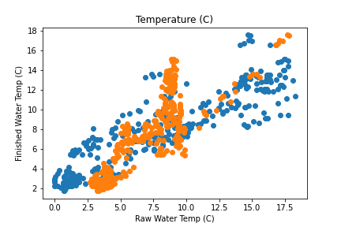

# Project-3

This project utilzes Scikit-Learn paired with MatPlotLib and Pandas to try and determine which, if any, factors are key contributors in the annual quality of the Fort Collins water. By using Scikit-Learn, the data was able to be fitted into models and those models were then used to predict the data. As well as to determine if the predicted data is decent by using Mean Squared Errors (mse) and r^2. The measured values that were used were: pH, turbidity (NTU), and temperature (C). Sourced data is available here: <src = "https://opendata.fcgov.com/Environmental-Health/City-of-Fort-Collins-Water-Quality/8n27-taq6"> as a downloadble csv file.

# Initial Plot

The csv file was read using pd.read_csv and turned into a cleaned dataframe. The columns containing the data for pH, turbidity, and temperature were assigned X and y values so the data can be plotted. Below is one of a few initial plots. For comparison, the data was plotted as such: "Poudre Water and Finished Water" vs "Horsetooth Water and Finished Water" to see if there was a noticeable difference of the source water's effect on the finished water product. Even though the water plant uses two different water sources, the data was consistent at this point.

# Using Scikit-Learn

Using mse and r^2 helped determine how well the models predicted the data. The closer the values for the mse and r^2 are to 0, the better the model prediction is. Based on the two values calculated, the chart below is the one that has both the mse and r^2 values closer than the other two measurements that were analyzed. This is because the value of the mse is closer to 0 than any of the other charts/comparisons. Which means the difference between the error of the actual value and the estimated value was the lowest calculated value. The runner up chart contains the next two lowest values, which is in the same measured value as the first chart. Both charts are shown below. For reference, the first chart had a mse value of 4.9891 and a r^2 value of 0.6895 while the second chart had a mse value of 13.2818 and r^2 value of 0.1734. While having a lower r^2 is great, the margin of error is slightly higher. Hence why the first chart is deemed the better predicted model.

   

#Conclusion

Initially, it was believed that turbidity was the sole key factor in regards to having good water quality since the turbidity is the measurement of the water's clarity. But, based on the prediction of the data, the temperature plays a big role as well and has trended to be consistent. That makes sense because when the weather is cold, the water is stagnant, which means there is less debris to go into the water and affect the turbidity. When the weather increases, the icy waters melt, causing runoff and in turn bringing debris. Plus, it is nice to have cold water running out of the faucet.
